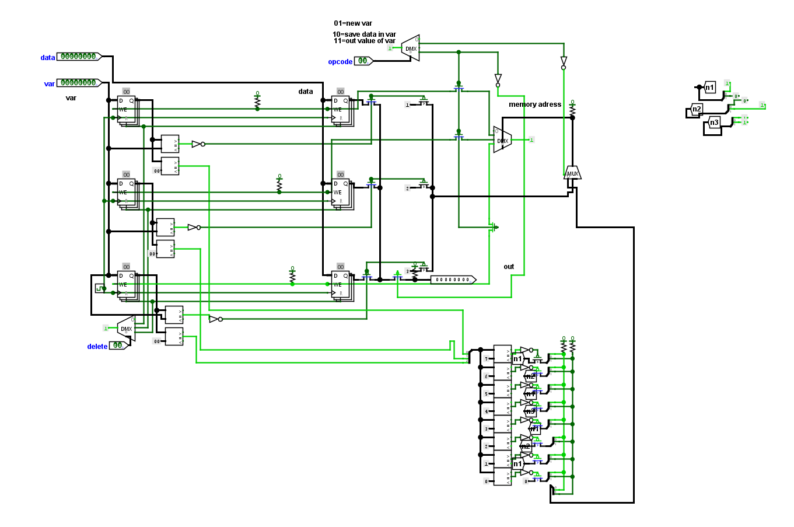

Hello, I'm a lover of computer architecture from Brazil.
I'm creating a new microcontroller architecture that's easier to program in assembly
This architecture aims to facilitate assembly programming on microcontrollers,adding variables and creating a new language that is much simpler and compiled by hardware, making embedded systems programming faster and less tedious.

## Architecture Overview

It's a register bank with native support for variables, designed to simplify assembly programming by enabling direct variable handling in hardware.  
This architecture targets faster, less error-prone embedded development through a hardware-compiled, high-level assembly model.

